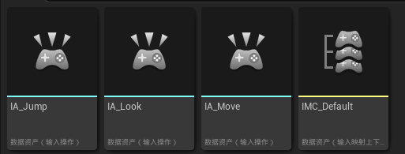
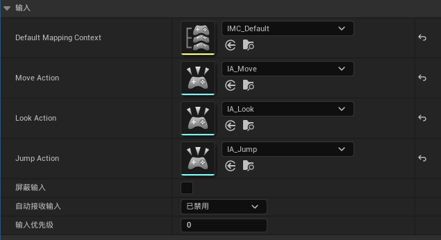
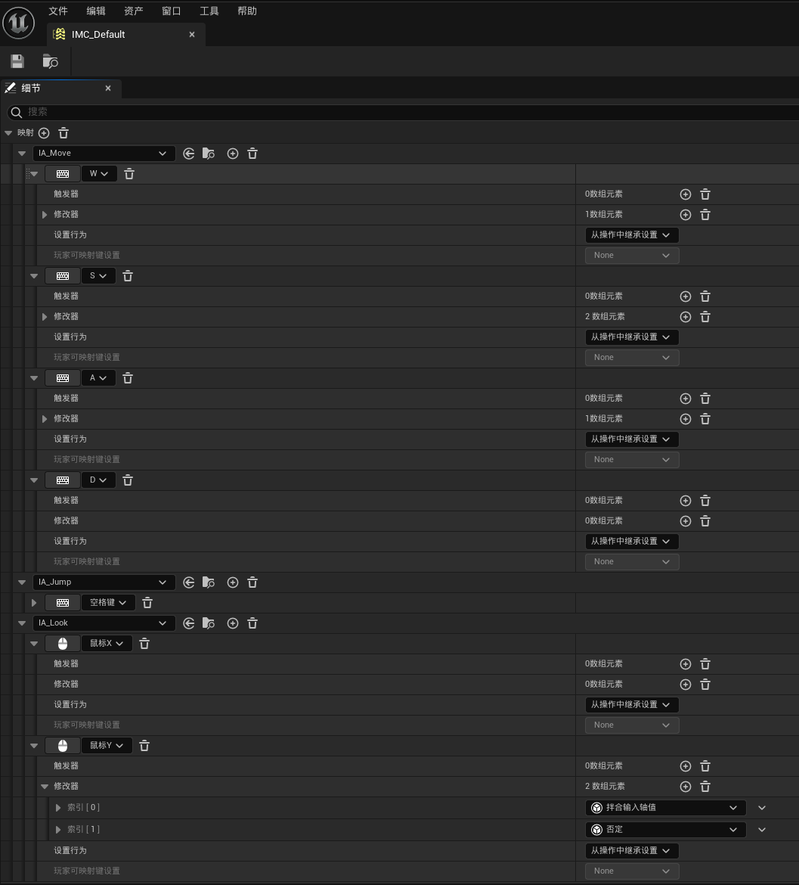

## 依赖与包含文件
在**project.Build.cs**依赖模块中添加 **EnhancedInput** 模块。
```cs
PublicDependencyModuleNames.AddRange(new string[] { "Core", "CoreUObject", "Engine", "InputCore", "EnhancedInput" });
```

在角色类头文件中包含 **InputActionValue.h** ，其中的 **FInputActionValue** 是一个结构体。
```c++
#include "InputActionValue.h" 
```
在角色实现文件中包含：
```c++
#include "EnhancedInputComponent.h"
#include "EnhancedInputSubsystems.h"
#include "InputAction.h"
#include "InputMappingContext.h"
#include "GameFramework/CharacterMovementComponent.h"
```

## 角色基本移动输入
```c++
    // .h
    // 输入动作
    UPROPERTY(EditAnywhere, Category="Input")
    UInputMappingContext* DefaultMappingContext;

    UPROPERTY(EditAnywhere, Category="Input")
    UInputAction* MoveAction;

    UPROPERTY(EditAnywhere, Category="Input")
    UInputAction* LookAction;

    UPROPERTY(EditAnywhere, Category="Input")
    UInputAction* JumpAction;

    // 输入处理函数
    void Move(const FInputActionValue& Value);
    void Look(const FInputActionValue& Value);
    void StartJump(const FInputActionValue& Value);
    void StopJump(const FInputActionValue& Value);

    // .cpp
    ASlashCharacter::ASlashCharacter()
{
	bUseControllerRotationPitch = false;
	bUseControllerRotationRoll = false;
	bUseControllerRotationYaw = false;
	// 获取角色的移动组件，并设置面向移动方向
	UCharacterMovementComponent* MoveComp = GetCharacterMovement();
	MoveComp->bOrientRotationToMovement = true;
}

    void ASlashCharacter::BeginPlay()
{
    Super::BeginPlay();

    // 添加输入映射上下文
    if (APlayerController* PlayerController = Cast<APlayerController>(Controller))
    {
        if (ULocalPlayer* LocalPlayer = PlayerController->GetLocalPlayer())
        {
            if (UEnhancedInputLocalPlayerSubsystem* Subsystem = LocalPlayer->GetSubsystem<UEnhancedInputLocalPlayerSubsystem>())
            {
                if (DefaultMappingContext)
                {
                    Subsystem->AddMappingContext(DefaultMappingContext, 0);
                }
            }
        }
    }
}

void ASlashCharacter::SetupPlayerInputComponent(UInputComponent* PlayerInputComponent)
{
    Super::SetupPlayerInputComponent(PlayerInputComponent);

    if (UEnhancedInputComponent* EnhancedInput = Cast<UEnhancedInputComponent>(PlayerInputComponent))
    {
        // 绑定 Enhanced Input 动作
        if (MoveAction)
        {
            EnhancedInput->BindAction(MoveAction, ETriggerEvent::Triggered, this, &ASlashCharacter::Move);
        }

        if (LookAction)
        {
            EnhancedInput->BindAction(LookAction, ETriggerEvent::Triggered, this, &ASlashCharacter::Look);
        }

        if (JumpAction)
        {
            EnhancedInput->BindAction(JumpAction, ETriggerEvent::Started, this, &ASlashCharacter::StartJump);
            EnhancedInput->BindAction(JumpAction, ETriggerEvent::Completed, this, &ASlashCharacter::StopJump);
        }
    }
}
```

接下来在蓝图中创建：
**IA_Move**：类型选择 Axis2D，用于处理移动输入（如 WSAD 键或左摇杆）。
**IA_Look**：类型选择 Axis2D，用于处理视角控制（如鼠标移动或右摇杆）。
**IA_Jump**：类型选择 Digital，用于处理跳跃动作（如空格键或手柄的跳跃按钮）。
**IMC_Deault**：默认输入映射上下文。


在角色蓝图的详细设置中，将这些资产分配到c++中的**输入动作**(InputAction)。


角色移动的代码如下：
```c++
void ASlashCharacter::Move(const FInputActionValue& Value)
{
	FVector2D MovementVector = Value.Get<FVector2D>();

	if (Controller && MovementVector != FVector2D::ZeroVector)
	{
		// 获取控制器的旋转(世界坐标)
		const FRotator ControlRotation = Controller->GetControlRotation();
		// 获取 Yaw 分量
		const FRotator YawRotation(0, ControlRotation.Yaw, 0);

		// 计算前进和右方向向量
		const FVector ForwardDirection = FRotationMatrix(YawRotation).GetUnitAxis(EAxis::X);
		const FVector RightDirection = FRotationMatrix(YawRotation).GetUnitAxis(EAxis::Y);

		// 添加移动输入
		AddMovementInput(ForwardDirection, MovementVector.Y);
		AddMovementInput(RightDirection, MovementVector.X);
	}
}
```

[知乎：旋转矩阵推导](https://zhuanlan.zhihu.com/p/12738165082)

以及对应的 **IMC_Deault** 映射
