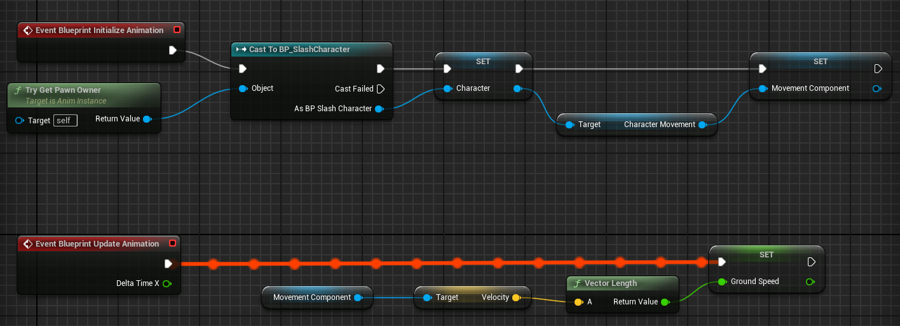

## UAnimInstance
### USlashAnimInstance 简介
`USlashAnimInstance` 继承自 `UAnimInstance`，作为**动画蓝图**的**父类**，在动画蓝图中更新角色运动相关的动画参数。  
- 在 **初始化阶段**（`NativeInitializeAnimation`）获取并缓存角色实例与其移动组件。  
- 在 **每帧更新阶段**（`NativeUpdateAnimation`）根据速度计算地面速度，并通过蓝图变量暴露给动画系统。

---

### 程序示例
头文件：
```cpp
// 拥有此 AnimInstance 的角色指针
UPROPERTY(BlueprintReadOnly, Category = "Movement")
ASlashCharacter* SlashCharacter;

// 缓存的角色移动组件指针
UPROPERTY(BlueprintReadOnly, Category = "Movement")
UCharacterMovementComponent* SlashCharacterMovementComponent;

// 供动画蓝图读取的地面速度
float GroundSpeed;
```

实现文件：
```c++
#include "Characters/SlashAnimInstance.h"
#include "Characters/SlashCharacter.h"
#include "GameFramework/CharacterMovementComponent.h"
#include "Kismet/KismetMathLibrary.h"

void USlashAnimInstance::NativeInitializeAnimation()
{
	Super::NativeInitializeAnimation();

	SlashCharacter = Cast<ASlashCharacter>(TryGetPawnOwner());
	if (SlashCharacter)
	{
		SlashCharacterMovementComponent = Cast<UCharacterMovementComponent>(SlashCharacter->GetMovementComponent());
	}
}

void USlashAnimInstance::NativeUpdateAnimation(float DeltaTime)
{
	Super::NativeUpdateAnimation(DeltaTime);

	if (SlashCharacterMovementComponent)
	{
		GroundSpeed = UKismetMathLibrary::VSizeXY(SlashCharacterMovementComponent->Velocity);
	}
}
```

对应的蓝图事件图表：
